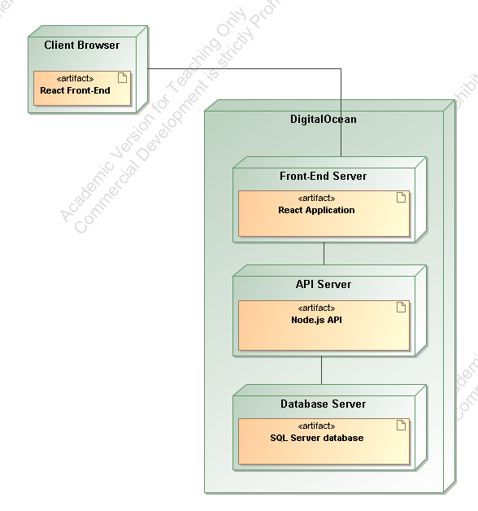
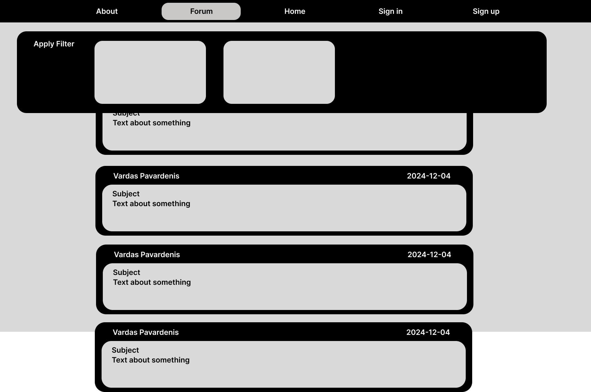
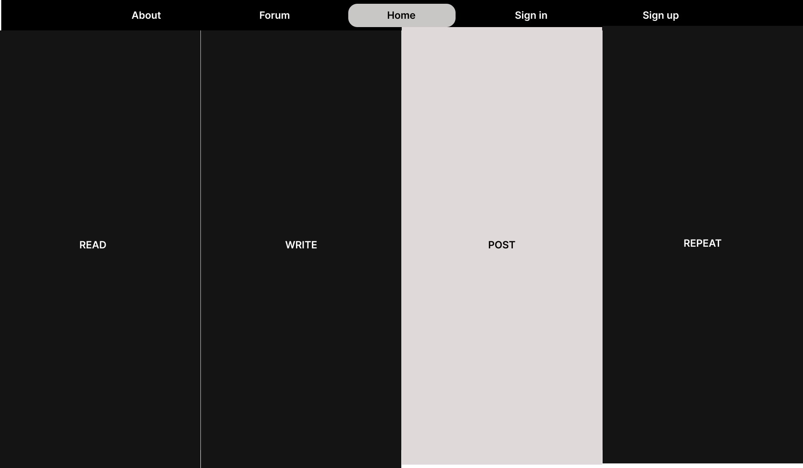
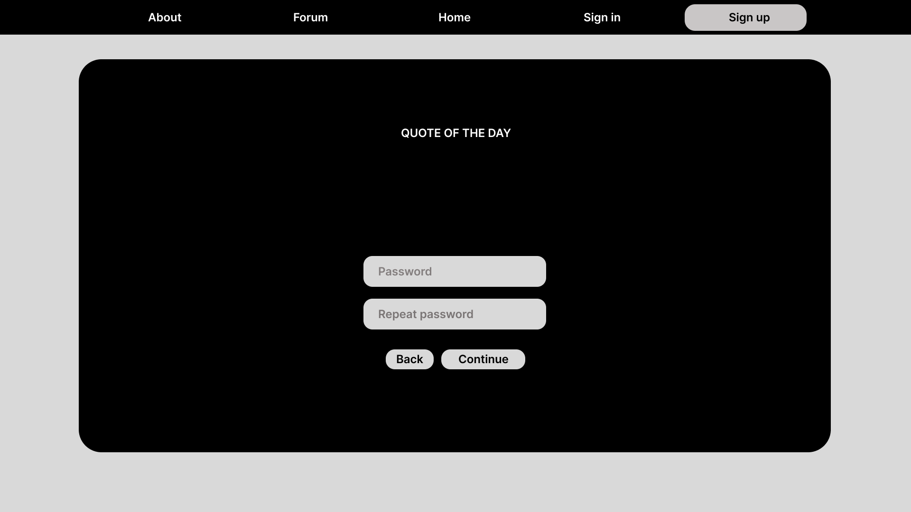
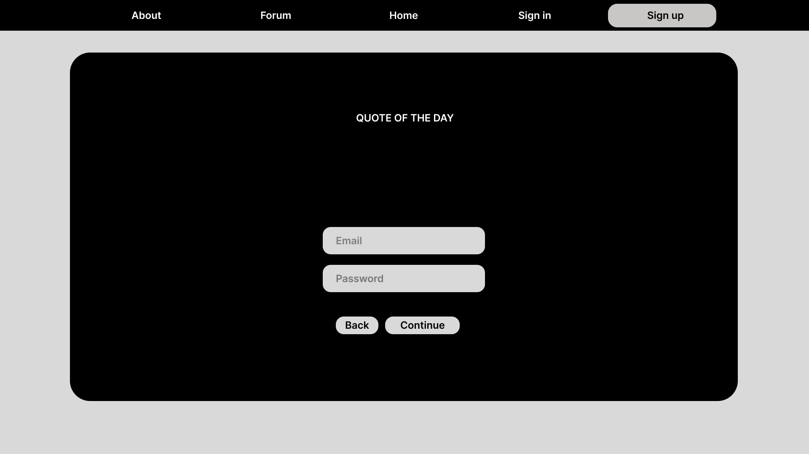

# Pradinio Ugdymo Pedagogų Pamokų Integracijos Idėjų Forumas

## Sprendžiamo Uždavinio Aprašymas
Ši sistema skirta padėti pradinio ugdymo pedagogams dalintis idėjomis ir metodais, kaip integruoti įvairias veiklas pamokose. Pastebėjus, kad dažnai pritrūksta idėjų ir jos ieškomos socialinėse platformose, sukuriama vieninga ir lengvai pasiekiama platforma, kuri:
- Leidžia pedagogams bendrauti ir dalintis idėjomis.
- Užtikrina, kad informacija būtų lengvai prieinama ir sisteminga.
- Sprendžia neaktyvių ar mažai pasiekiamų grupių problemą.

### Sistemos Tikslas
Sukurti platformą, kurioje pradinio ugdymo pedagogai galėtų:
- Rasti ir dalintis idėjomis pagal kategorijas.
- Diskutuoti ir rašyti atsiliepimus apie pateiktas idėjas.
- Bendradarbiauti siekiant geresnės pamokų kokybės.

## GitHub Repozitorija
[https://github.com/SharkyKing/STPP_Projektas.git](https://github.com/SharkyKing/STPP_Projektas.git)

---

## Funkciniai Reikalavimai

### Rolių Aprašymai (Paveldimumo principas: Sveičias → Pedagogas → Administratorius)

#### **Svečias**
- Peržiūrėti įrašus ir komentarus.
- Filtruoti įrašus pagal kategorijas, klases, dalykus.
- Registruotis, norint kurti įrašus ir rašyti komentarus.

#### **Pedagogas**
- Viešai pateikti informaciją (patirtis, mokymosi įstaiga, miestas).
- Registracija patvirtinama el. paštu.
- Slaptažodžio priminimo funkcija.
- Atlikti CRUD operacijas (sukurti, skaityti, redaguoti, ištrinti) įrašams ir komentarams.
- Prisegti failus prie įrašų.
- Prisijungti prie sistemos.

#### **Administratorius**
- Atlikti CRUD operacijas visiems įrašams ir komentarams.
- Blokuoti vartotojus.
- Blokuoti turinį.

---

## Pasirinktų Technologijų Aprašymas

1. **React**
   - Komponentais grįsta dizaino struktūra leidžia pernaudoti kodą ir kurti našias vartotojo sąsajas.
   - Turi plačią bendruomenę ir gausybę išteklių, kurie padeda greitai rasti sprendimus.

2. **REST API**
   - Naudojamas HTTP užklausoms, užtikrinant greitą sąsają su serveriu.
   - Lengvai išplečiama struktūra, tinkanti didesnio masto projektams.

3. **Axios**
   - Palengvina asinchroninių HTTP užklausų kūrimą.
   - Automatiškai apdoroja JSON objektus.
   - Leidžia lengvai aprašyti klaidų išimtis ir teikia papildomas funkcijas, pvz., užklausų atšaukimą.

4. **Node.js**
   - Populiari „JavaScript“ platforma, palaikanti lygiagrečius prisijungimus.
   - Dažnai naudojama autentifikacijai ir duomenų bazių apdorojimui.

---
## OPEN API specifikacijos failas  [Swagger API Documentation](api-docs.json)
---
## Deployment diagrama

---
## Naudotojo sąsajos projektas
---
### Dizainas remiantis Figma
<table>
  <tr>
    <td></td>
    <td></td>
  </tr>
  <tr>
    <td></td>
    <td></td>
  </tr>
  <tr>
    <td></td>
    <td></td>
  </tr>
  <tr>
    <td></td>
  </tr>
</table>

---

### Sukurtas dizainas
<table>
  <tr>
    <td></td>
    <td></td>
  </tr>
  <tr>
    <td></td>
    <td></td>
  </tr>
  <tr>
    <td></td>
    <td></td>
  </tr>
  <tr>
    <td></td>
    <td></td>
  </tr>
  <tr>
    <td></td>
  </tr>
</table>

## Projekto išvados
Pradedant projektą atrodė, kad užduotis nebus sunki. Visa idėją sukosi mintyse ir atrodė niekas nebus pamiršta ir nedadaryta. Prieš tęsiant, norėčiau paminėti, kad šis projektas yra 4-tas variantas. Iš viso prieš tai turėjau dar 3 projektus. To priežastis buvo, menkas planavimas, tvarkos nesilaikymas, darymas negalvojant kelių žingsnių į priekį. Pastebėjau, kad būtina yra vos ne visiškai suplanuoti projekto funkcionalo dalį iki pat galo ir apgalvoti viską kas įmanoma ir tik tada pradėti rašyti kodą. Kai padaromos klaidos ir jos paliekamos vėlesniam pataisymui, šias yra labai sunku sutvarkyti tinkamai, prireikia daug kodo keitimo keliose vietose, aprašymų keitimo. Su 4-tu projektu visa tai išmokau. Bet ką galiu pasakyti, kad vistiek pritrūksta dar planavimo įgudžių.

---

Svarbu paminėti ir tai, kad projektas labai padėjo suvokti puslapio kūrimo eigą. Nors dar ne viskas padaryta ir išbandyta. Nėra testavimo dalių, puslalpio paleidimo. Taip pat išmokau daug dalykų, kad siejasi su React komponentų valdymų, dizaino parametrais, css valdymas bei backend kontrolė.

---

I labaratorino darbo metu buvo išmokta kaip teisingai aprašyti API sąsajas. Kaip rašyti pagal taisykles, kaip valdyti hierarchine dalį. Ir viso to aš nei kiek nežinojau iki to, kai reikėjo jau tai atlikti. II lab. darbo metu buvo akcentuojamas token valdymas. Galiu pripažinti, kad ši dalis atrodė baisiausiai, nes neturėjau nei menkiausio supratimo kaip tai veikia ir kaip tai padaryti saugiai. Po šio darbo, atsirado pakankamai bazinių žinių tai įgyvendinti savarankiškai. III labaratorinis darbos buvo akcentuotas į dizainą. Išmokau kaip teisingai valdyti komponentų dalis, kaip apibrėžti atitinkamus parametrus, taip pat išmokau kas yra ir responsive dalies valdymas. 

---
Apibendrinant, noriu pasakyti, kad projekto kūrimas nėra kodo lango atsidarymas ir vien tik rašymas. Reikalingas kritinis, loginis mąstymai. Galvojimas apie kelis žingsnius į priekį, bei žinoma žiūrėjimas į projektą, ne tik kaip į funcionalo dalis, bet kaip į visumą. Nors ir atrodo, kad tam tikros funkcijos nėra susijusios su kitais langais, kartais tai būna ne tiesa, ir neapgalvojus vienos dalies, nugriūna kita. 
