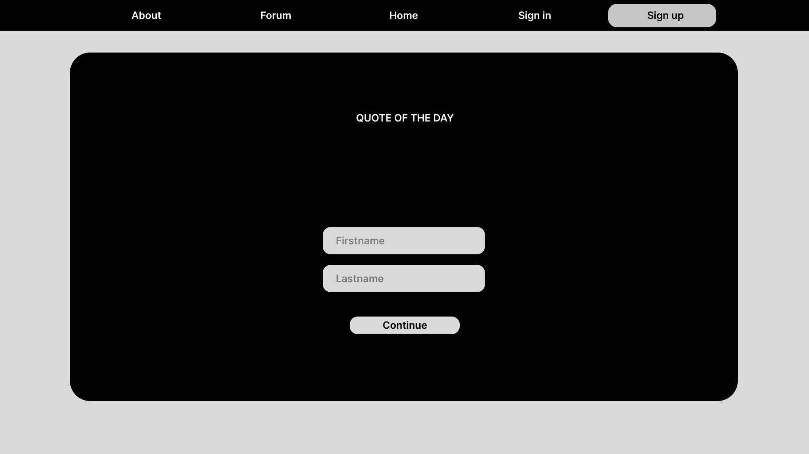

# Pradinio Ugdymo Pedagogų Pamokų Integracijos Idėjų Forumas

## Sprendžiamo Uždavinio Aprašymas
Ši sistema skirta padėti pradinio ugdymo pedagogams dalintis idėjomis ir metodais, kaip integruoti įvairias veiklas pamokose. Pastebėjus, kad dažnai pritrūksta idėjų ir jos ieškomos socialinėse platformose, sukuriama vieninga ir lengvai pasiekiama platforma, kuri:
- Leidžia pedagogams bendrauti ir dalintis idėjomis.
- Užtikrina, kad informacija būtų lengvai prieinama ir sisteminga.
- Sprendžia neaktyvių ar mažai pasiekiamų grupių problemą.

### Sistemos Tikslas
Sukurti platformą, kurioje pradinio ugdymo pedagogai galėtų:
- Rasti ir dalintis idėjomis pagal kategorijas.
- Diskutuoti ir rašyti atsiliepimus apie pateiktas idėjas.
- Bendradarbiauti siekiant geresnės pamokų kokybės.

## GitHub Repozitorija
[https://github.com/SharkyKing/STPP_Projektas.git](https://github.com/SharkyKing/STPP_Projektas.git)

---

## Funkciniai Reikalavimai

### Rolių Aprašymai (Paveldimumo principas: Sveičias → Pedagogas → Administratorius)

#### **Svečias**
- Peržiūrėti įrašus ir komentarus.
- Filtruoti įrašus pagal kategorijas, klases, dalykus.
- Registruotis, norint kurti įrašus ir rašyti komentarus.

#### **Pedagogas**
- Viešai pateikti informaciją (patirtis, mokymosi įstaiga, miestas).
- Registracija patvirtinama el. paštu.
- Slaptažodžio priminimo funkcija.
- Atlikti CRUD operacijas (sukurti, skaityti, redaguoti, ištrinti) įrašams ir komentarams.
- Prisegti failus prie įrašų.
- Prisijungti prie sistemos.

#### **Administratorius**
- Atlikti CRUD operacijas visiems įrašams ir komentarams.
- Blokuoti vartotojus.
- Blokuoti turinį.

---

## Pasirinktų Technologijų Aprašymas

1. **React**
   - Komponentais grįsta dizaino struktūra leidžia pernaudoti kodą ir kurti našias vartotojo sąsajas.
   - Turi plačią bendruomenę ir gausybę išteklių, kurie padeda greitai rasti sprendimus.

2. **REST API**
   - Naudojamas HTTP užklausoms, užtikrinant greitą sąsają su serveriu.
   - Lengvai išplečiama struktūra, tinkanti didesnio masto projektams.

3. **Axios**
   - Palengvina asinchroninių HTTP užklausų kūrimą.
   - Automatiškai apdoroja JSON objektus.
   - Leidžia lengvai aprašyti klaidų išimtis ir teikia papildomas funkcijas, pvz., užklausų atšaukimą.

4. **Node.js**
   - Populiari „JavaScript“ platforma, palaikanti lygiagrečius prisijungimus.
   - Dažnai naudojama autentifikacijai ir duomenų bazių apdorojimui.

---

## Naudotojo sąsajos projektas
---
### Dizainas remiantis Figma
<table>
  <tr>
    <td></td>
    <td></td>
  </tr>
  <tr>
    <td></td>
    <td></td>
  </tr>
  <tr>
    <td></td>
    <td></td>
  </tr>
  <tr>
    <td></td>
  </tr>
</table>
---
### Sukurtas dizainas
